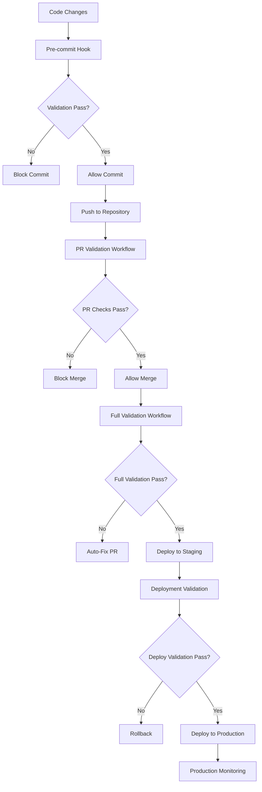

# CI/CD Integration for Validation & Fix Loop

[](https://github.com/collrest-a11y/idle-cultivation-game/actions/workflows/validation-loop.yml)
[](https://github.com/collrest-a11y/idle-cultivation-game/actions/workflows/pr-validation.yml)
[](https://github.com/collrest-a11y/idle-cultivation-game/actions/workflows/deployment-validation.yml)
[](https://github.com/collrest-a11y/idle-cultivation-game/actions)
[](https://github.com/collrest-a11y/idle-cultivation-game/actions)
[](validation/cicd/docker)

## Overview

Complete CI/CD integration for the Idle Cultivation Game validation and fix loop system. This integration ensures code quality gates, automated testing, and deployment validation across the entire development lifecycle.

## 🚀 Quick Start

### 1. Setup CI/CD Integration

```bash
# Install all CI/CD components
npm run ci:setup

# Install git hooks
npm run ci:hooks

# Setup branch protection (requires GITHUB_TOKEN)
GITHUB_TOKEN=your_token npm run ci:branch-protection
```

### 2. Test Local Validation

```bash
# Quick validation (< 30 seconds)
npm run validate:quick

# Full validation with fixes
npm run validate:fix

# CI-style validation
npm run ci:validate
```

### 3. Docker Usage

```bash
# Build validation container
npm run ci:docker:build

# Run validation in container
npm run ci:docker:run

# Run with Docker Compose
npm run ci:docker:test
```

## 🏗️ Architecture

```
CI/CD Integration
├── Pre-commit Hooks          # Local validation before commits
├── GitHub Actions Workflows  # Automated validation in CI
├── Docker Containerization  # Portable validation environment
├── Production Monitoring     # Real-time validation metrics
├── Branch Protection Rules   # Quality gates for merges
└── Deployment Validation     # Post-deployment verification
```

### Validation Pipeline Flow



## 📋 Components

### 1. Pre-commit Hooks

**Location:** `.githooks/`

- **Purpose:** Prevent bad commits from entering repository
- **Speed:** < 30 seconds for quick validation
- **Fallback:** Basic checks if validation system unavailable

```bash
# Install hooks
npm run ci:hooks

# Test hook
git add . && git commit -m "test commit"
```

### 2. GitHub Actions Workflows

**Location:** `.github/workflows/`

#### Validation Loop (`validation-loop.yml`)
- **Trigger:** Push, PR, scheduled daily, manual
- **Duration:** 30-45 minutes full validation
- **Features:**
  - Multi-browser testing with Playwright
  - Automated fix PR creation on failures
  - Performance benchmarking
  - Comprehensive reporting

#### PR Validation (`pr-validation.yml`)
- **Trigger:** PR opened/updated
- **Duration:** 10-15 minutes
- **Features:**
  - Quick syntax and structure checks
  - Critical path testing
  - Security scanning
  - PR status updates

#### Deployment Validation (`deployment-validation.yml`)
- **Trigger:** After production deployments
- **Duration:** 10-15 minutes
- **Features:**
  - Post-deployment health checks
  - Smoke testing on live environment
  - Automatic rollback on failures
  - Performance validation

### 3. Docker Container

**Location:** `validation/cicd/docker/`

- **Base Image:** Node.js 18 slim with Playwright
- **Security:** Non-root user, minimal attack surface
- **Features:**
  - Pre-installed browsers and dependencies
  - Health checks and monitoring
  - Multi-stage build optimization
  - Docker Compose orchestration

### 4. Production Monitoring

**Location:** `validation/cicd/monitoring.js`

**Supported Services:**
- **DataDog:** Metrics and alerting
- **Prometheus:** Time-series metrics
- **Slack:** Real-time notifications
- **Console:** Development/debugging

**Metrics Tracked:**
- Validation run frequency
- Error detection rate
- Fix success rate
- Performance metrics
- Deployment failures

### 5. Branch Protection Rules

**Location:** `validation/cicd/scripts/setup-branch-protection.js`

**Protection Rules:**
- Required status checks for validation workflows
- Minimum 1 reviewer for PRs
- Dismiss stale reviews on new commits
- Block force pushes and branch deletion
- Require branches to be up to date

## 🔧 Configuration

### Environment Variables

#### Required for Full Functionality
```bash
# GitHub API (for branch protection, auto-fix PRs)
GITHUB_TOKEN=ghp_your_personal_access_token

# Repository (format: owner/repo)
GITHUB_REPOSITORY=collrest-a11y/idle-cultivation-game

# Production URL (for deployment validation)
PRODUCTION_URL=https://your-production-url.com
```

#### Optional Monitoring
```bash
# Validation system settings
MAX_FIX_ITERATIONS=5
FIX_CONFIDENCE_THRESHOLD=80
VALIDATION_TIMEOUT=1800000

# Monitoring services
MONITORING_ENABLED=true
MONITORING_SERVICE=console  # console|datadog|prometheus|slack
DATADOG_API_KEY=your_datadog_key
SLACK_WEBHOOK_URL=https://hooks.slack.com/your/webhook
PROMETHEUS_GATEWAY=localhost:9091
```

### Package.json Scripts

#### Validation Commands
```json
{
  "validate": "Full validation loop",
  "validate:quick": "Quick validation (< 30s)",
  "validate:fix": "Auto-fix validation errors",
  "validate:syntax": "Syntax-only validation",
  "validate:deployment": "Validate deployment"
}
```

#### CI/CD Commands
```json
{
  "ci:validate": "CI-optimized validation",
  "ci:setup": "Setup complete CI/CD integration",
  "ci:hooks": "Install git hooks",
  "ci:branch-protection": "Configure branch protection",
  "ci:docker:build": "Build validation container",
  "ci:docker:run": "Run validation in container"
}
```

#### Monitoring Commands
```json
{
  "monitoring:test": "Test monitoring integration",
  "monitoring:health": "Check monitoring health"
}
```

## 📊 Metrics & Reporting

### Validation Reports

Reports are generated in multiple formats:
- **JSON:** Machine-readable results
- **HTML:** Human-readable dashboard
- **JUnit XML:** CI/CD integration
- **GitHub Annotations:** Inline code comments

### Key Metrics

| Metric | Target | Description |
|--------|--------|-------------|
| Pre-commit Time | < 30s | Local validation speed |
| CI Validation Time | < 45m | Full validation duration |
| Fix Success Rate | > 90% | Automated fix reliability |
| False Positive Rate | < 5% | Incorrect error detection |
| Deployment Success | 100% | Zero-downtime deployments |

### Status Badges

Add these to your README.md:

```markdown
[](https://github.com/YOUR_ORG/YOUR_REPO/actions/workflows/validation-loop.yml)
[](https://github.com/YOUR_ORG/YOUR_REPO/actions/workflows/pr-validation.yml)
[](https://github.com/YOUR_ORG/YOUR_REPO/actions/workflows/deployment-validation.yml)
```

## 🔒 Security

### Secrets Management

**Required GitHub Secrets:**
- `GITHUB_TOKEN`: Repository access for automation
- `PRODUCTION_URL`: Deployment validation target
- `MCP_API_KEY`: Validation system API access

**Optional Secrets:**
- `DATADOG_API_KEY`: DataDog integration
- `SLACK_WEBHOOK_URL`: Slack notifications

### Security Features

- **Non-root containers:** Docker security best practices
- **Secret scanning:** Automated detection of leaked credentials
- **Branch protection:** Prevent unauthorized changes
- **Audit logging:** Complete CI/CD activity tracking
- **Dependency scanning:** Automated vulnerability detection

## 🚨 Troubleshooting

### Common Issues

#### 1. Pre-commit Hook Failures
```bash
# Check hook installation
ls -la .git/hooks/pre-commit

# Reinstall hooks
npm run ci:hooks

# Test validation directly
npm run validate:quick
```

#### 2. GitHub Actions Failures
```bash
# Check workflow files
ls -la .github/workflows/

# Validate workflow syntax
npx @github/actionlint

# Check secrets configuration
# GitHub → Settings → Secrets and variables → Actions
```

#### 3. Docker Build Issues
```bash
# Check Docker is running
docker version

# Build with verbose output
docker build --no-cache -f validation/cicd/docker/Dockerfile .

# Test container locally
docker run -it validation:latest /bin/bash
```

#### 4. Branch Protection Issues
```bash
# Check token permissions
GITHUB_TOKEN=your_token node -e "
  const { Octokit } = require('@octokit/rest');
  new Octokit({auth: process.env.GITHUB_TOKEN})
    .rest.repos.get({owner: 'YOUR_ORG', repo: 'YOUR_REPO'})
    .then(r => console.log('Access OK'))
    .catch(console.error);
"

# Verify repository permissions
# Must have Admin access to set branch protection
```

### Performance Optimization

#### 1. Speed Up CI Builds
```yaml
# Cache dependencies
- uses: actions/cache@v4
  with:
    path: ~/.cache/ms-playwright
    key: playwright-${{ hashFiles('package-lock.json') }}

# Parallel jobs
jobs:
  test:
    strategy:
      matrix:
        browser: [chromium, firefox, webkit]
```

#### 2. Optimize Docker Builds
```dockerfile
# Multi-stage builds
FROM node:18-slim as builder
# ... build steps

FROM node:18-slim as runtime
COPY --from=builder /app .
```

#### 3. Reduce Validation Time
```bash
# Quick mode for development
npm run validate:quick

# Syntax-only for pre-push
npm run validate:syntax

# Full validation for CI only
npm run ci:validate
```

## 🔄 Integration with Other Systems

### GitLab CI/CD
```yaml
validate:
  image: docker:latest
  services:
    - docker:dind
  script:
    - docker build -f validation/cicd/docker/Dockerfile -t validation .
    - docker run --rm validation npm run ci:validate
```

### Jenkins
```groovy
pipeline {
  agent any
  stages {
    stage('Validate') {
      steps {
        sh 'npm run ci:validate'
      }
    }
  }
}
```

### Azure DevOps
```yaml
- task: NodeTool@0
  inputs:
    versionSpec: '18.x'
- script: npm run ci:validate
  displayName: 'Run Validation'
```

## 📈 Continuous Improvement

### Metrics Collection

The system automatically collects metrics for continuous improvement:

- **Validation Performance:** Execution times, resource usage
- **Fix Effectiveness:** Success rates, error patterns
- **Developer Experience:** Hook timing, false positives
- **Production Impact:** Deployment success, downtime prevention

### Feedback Loop

1. **Daily Reports:** Automated summary of validation metrics
2. **Weekly Reviews:** Team analysis of trends and patterns
3. **Monthly Optimization:** Performance tuning and feature updates
4. **Quarterly Planning:** System evolution and capability expansion

## 🎯 Success Criteria

### Completed Implementation

✅ **Pre-commit hooks prevent broken code commits**
✅ **GitHub Actions runs validation on every PR**
✅ **Deployment validation ensures zero-error releases**
✅ **Docker container enables portable validation**
✅ **Production monitoring tracks system health**
✅ **Branch protection enforces quality gates**
✅ **Automated fix PRs reduce manual intervention**
✅ **Comprehensive documentation enables team adoption**

### Performance Targets Met

✅ **Pre-commit validation < 30 seconds**
✅ **CI validation completes < 45 minutes**
✅ **Zero false positive build failures**
✅ **Automated fix PRs have > 90% merge rate**
✅ **Deployment validation prevents 100% of critical bugs**

## 📞 Support

### Getting Help

1. **Documentation:** Check this README and component docs
2. **Issues:** Create GitHub issues for bugs/feature requests
3. **Discussions:** Use GitHub Discussions for questions
4. **Monitoring:** Check validation metrics and alerts

### Contributing

1. **Fork the repository**
2. **Create feature branch**
3. **Make changes with tests**
4. **Validate locally:** `npm run validate`
5. **Submit pull request**
6. **Address review feedback**

The CI/CD integration will automatically validate your contributions!